# Evidence Repository Enhancement Plan

## Overview
This document outlines the planned improvements to the Evidence Repository component to enhance its marketability, persuasiveness, and truthfulness. The primary goal is to create a trusted, user-friendly platform for presenting verified evidence.

## Architecture

```mermaid
graph TB
    A[Improve Truth Verification] --> A1[Add Verification Status]
    A[Improve Truth Verification] --> A2[Add Fact-Checking Badges]
    A[Improve Truth Verification] --> A3[Multiple Source Citations]
    
    B[Enhance User Experience] --> B1[Visual Evidence Timeline]
    B[Enhance User Experience] --> B2[Interactive Data Visualizations]
    B[Enhance User Experience] --> B3[Advanced Search & Filters]
    
    C[Improve Content Presentation] --> C1[Evidence Impact Ratings]
    C[Improve Content Presentation] --> C2[Clear Context Sections]
    C[Improve Content Presentation] --> C3[Related Evidence Links]
    
    D[Ensure Data Accuracy] --> D1[Remove Future Dates]
    D[Ensure Data Accuracy] --> D2[Add Last Verified Date]
    D[Ensure Data Accuracy] --> D3[Source Status Checker]
```



## 1. Truth Verification Enhancements

### Verification Status System
- Implement verification badges:
  - ✓ Verified: Multiple reliable sources confirm
  - ⟳ Under Review: Currently being fact-checked
  - ⚠ Disputed: Conflicting information exists
- Add fact-checking organization badges (PolitiFact, Reuters Fact Check)
- Enable multiple source citations per evidence item
- Create methodology documentation section

### Implementation Details
```typescript
interface VerificationStatus {
  status: 'verified' | 'under_review' | 'disputed';
  lastChecked: Date;
  checkedBy: string[];
  factCheckUrls: string[];
}

interface EvidenceItem extends BaseEvidence {
  verification: VerificationStatus;
  sources: Source[];
  factCheckBadges: FactCheckBadge[];
}
```

## 2. User Experience Improvements

### Interactive Features
- Timeline view with zoom capabilities
- Advanced filtering system:
  - Date ranges
  - Verification status
  - Impact level
  - Source reliability
- Smart search functionality:
  - Autocomplete
  - Related suggestions
  - Tag-based search

### Search Architecture
```typescript
interface SearchParams {
  query: string;
  dateRange?: DateRange;
  verificationStatus?: VerificationStatus[];
  impactLevel?: ImpactLevel;
  tags?: string[];
}

interface SearchResults {
  items: EvidenceItem[];
  relatedSuggestions: string[];
  facets: SearchFacets;
}
```

## 3. Content Presentation Updates

### Evidence Card Enhancements
- Impact rating system (1-5 scale)
- Context sections for background information
- Related evidence suggestions
- Evidence strength indicators
- Cross-references to related items

### Visual Components
```typescript
interface EnhancedFactCard extends FactCard {
  impactRating: number;
  context: string;
  relatedEvidence: string[];
  strengthIndicator: 'strong' | 'moderate' | 'developing';
}
```

## 4. Data Accuracy Measures

### Data Validation
- Remove future-dated entries
- Add last verified timestamp
- Implement automated source checking
- Define clear evidence inclusion criteria

### Source Verification
```typescript
interface SourceValidation {
  url: string;
  lastChecked: Date;
  status: 'active' | 'archived' | 'unavailable';
  archiveUrl?: string;
  responseCode?: number;
}
```

## 5. Technical Improvements

### Performance Optimizations
- Server-side search implementation
- Loading states and error handling
- SEO metadata optimization
- Accessibility compliance (WCAG 2.1)

### Error Handling
```typescript
interface ErrorState {
  type: 'network' | 'validation' | 'server';
  message: string;
  retryCount: number;
  fallbackData?: any;
}
```

## 6. Trust Building Features

### Community Engagement
- Methodology documentation
- Expert review system
- Moderated feedback system
- Source reliability ratings

### User Trust Features
```typescript
interface TrustMetrics {
  expertReviews: ExpertReview[];
  communityFeedback: Feedback[];
  sourceReliability: ReliabilityScore;
  methodologyVersion: string;
}
```

## Implementation Priority

1. **Phase 1: Foundation**
   - Remove future-dated content
   - Implement verification status system
   - Add last verified dates
   - Create methodology documentation

2. **Phase 2: Enhanced Presentation**
   - Upgrade evidence cards
   - Add impact ratings
   - Implement context sections
   - Add source reliability indicators

3. **Phase 3: User Experience**
   - Develop timeline view
   - Implement advanced search
   - Add filtering system
   - Create tag system

4. **Phase 4: Trust Features**
   - Expert review system
   - Community feedback
   - Source reliability ratings
   - Cross-referencing system

## Next Steps

1. Review and approve this implementation plan
2. Set up development environment and testing infrastructure
3. Begin Phase 1 implementation
4. Conduct user testing after each phase
5. Iterate based on feedback

## Technical Requirements

- React 18+
- TypeScript
- TailwindCSS
- Server-side search capability
- API endpoints for verification
- Database for storing trust metrics